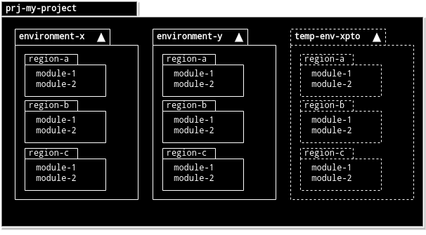
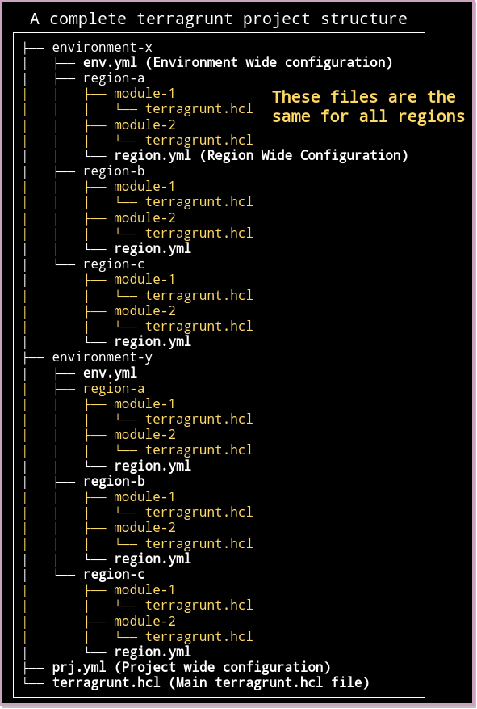
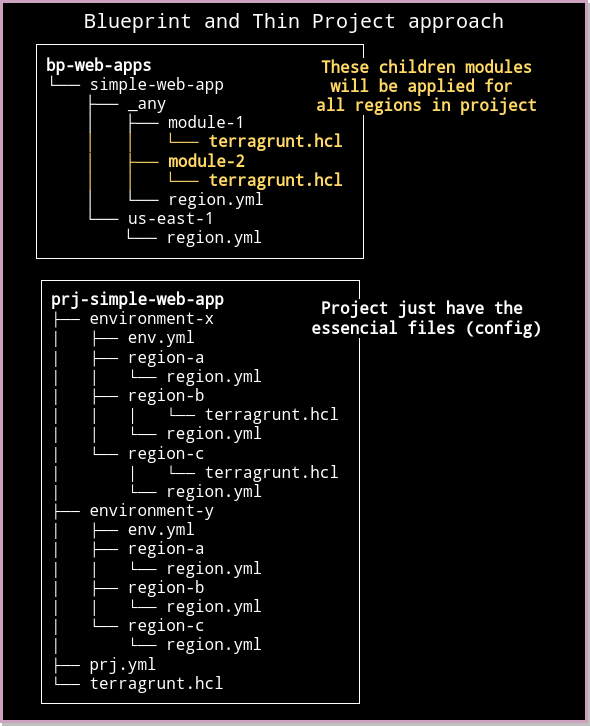
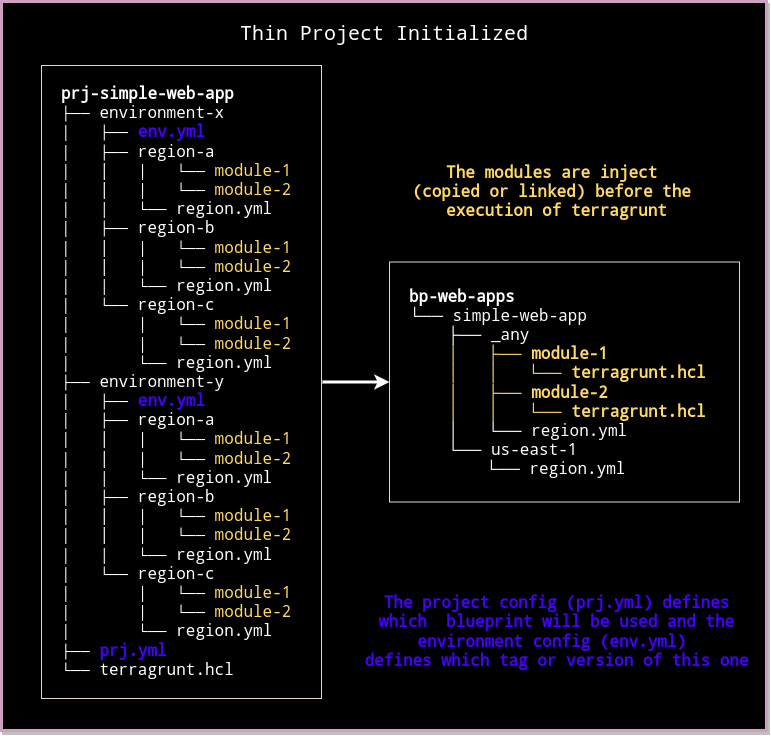

# SPY CLI

**SpyCLI** spycli the killer iac tool for deal with projects that follows the **Blueprint** and **Thin Projects** with **[terragrunt](https://terragrunt.gruntwork.io/)**.


## Demonstration

[](https://youtu.be/nBTP2VugADo)

## Terragrunt project structure

Lets consider the following scenario:

We need provide an infrastrucutre. This infrastructure must have two environments:
- **environment-x**
- **environment-y**

And this must be replicated in three regions:
- **region-a**
- **region-b**
- **region-c**

And each region must contains two modules:
- **module-1**
- **module-2**

These requeriments results in a project schema similar to this:



And the files and folders structure must to be like this:



### File repetition
```
Note: that every region have the same modules and this files repeats each region folder.
It's very bad to deal with and the **Blueprint and Thin Projec Approach** intents to solve this problem.
```

---

## Blueprint and Thin Project approach

On this approach we remove modules from each region from the project and then put theses files in a distributable and reusable **blueprint**.

The **blueprint** will contains the modules (per region or for any region) and the project will be composed of just the essencial files (aka config files)



---

## SpyCLI project init

SpyCLI helps cloud and devops enginners to manage projects using scaffolds and automations.

The most important is the command **init**. This commands creates the link between the project and the blueprint by copying or linkin files required


After the execution of project init command the files and folders structure will appears something like this:



---

## Commands Reference

### Access [SpyCLI commands reference](assets/docs/spycli.md) for more details